# Eval: Board Comprehension (FEN Question Answering)

Given a FEN, answer a factual question about the position. Tests whether an LLM can correctly read and interpret chess positions.

Each row: `(fen, question, answer, category, subcategory, phase, game_id, ply, move_uci, move_san)`

## Extraction

```bash
python generate_eval_fen_questions.py \
    --pgn_path ../data/lichess_db_standard_rated_2013-01.pgn \
    --out_dir data/ \
    --n_per_subcategory 500 \
    --max_games 5000 \
    --max_per_game 3 \
    --seed 42
```

## Categories and Subcategories (36 total)

| Category | Subcategories |
|---|---|
| Square Contents (3) | `piece_on_square`, `is_square_occupied`, `color_on_square` |
| Piece Counting (3) | `count_piece_type`, `count_color_pieces`, `count_all_pieces` |
| Piece Location (3) | `king_square`, `list_piece_squares`, `is_piece_on_square` |
| Material (3) | `which_side_more_material`, `material_value`, `is_material_equal` |
| Rank & File (4) | `count_on_rank`, `count_on_file`, `is_file_open`, `is_file_half_open` |
| Pawn Structure (4) | `doubled_pawns`, `isolated_pawn`, `pawn_islands`, `passed_pawn` |
| Metadata (6) | `side_to_move`, `can_castle_kingside`, `can_castle_queenside`, `en_passant_square`, `fullmove_number`, `halfmove_clock` |
| Spatial (3) | `pieces_between`, `same_rank`, `same_file` |
| Checks & Attacks (3) | `is_in_check`, `attackers_of_square`, `is_square_attacked` |
| Board Geometry (3) | `square_color`, `bishop_pair`, `bishop_square_colors` |
| After Move (1) | `en_passant_after_move` |

---

## 1. Square Contents

#### `piece_on_square` — What piece is on a given square?
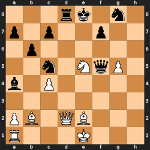

`3rk1n1/p1p2p2/1p6/2n1NqP1/b1P5/8/PB1QB3/R3K3 w Q` — **Q: What piece is on h6?** — A: Empty

#### `is_square_occupied` — Is a square occupied or empty?
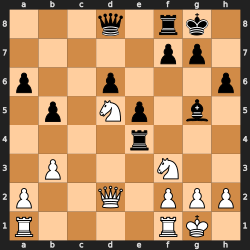

`3q1rk1/5pp1/p2p3p/1p1Np1b1/4r3/1P3N2/P2Q1PPP/R4RK1 w` — **Q: Is b8 occupied or empty?** — A: Empty

#### `color_on_square` — What color is the piece on a given square?
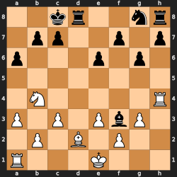

`2kr2nr/1pp2p1p/p3p1p1/8/1N5R/P1P1PbP1/1P1B1P2/R3K3 b Q` — **Q: What color is the piece on e6?** — A: Black

---

## 2. Piece Counting

#### `count_piece_type` — How many pieces of a specific type and color?
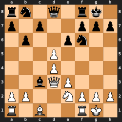

`rn1q1rk1/p1p2ppp/1p2pn2/3P4/3P4/2bQP3/PP2NPPP/R1B2RK1 w` — **Q: How many black bishops are on the board?** — A: 1

#### `count_color_pieces` — Total pieces for one side?
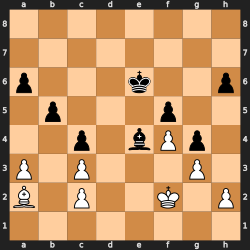

`8/8/p3k2p/1p3p2/2p1bPp1/P1P3P1/B1P2K1P/8 w` — **Q: How many total pieces does White have?** — A: 8

#### `count_all_pieces` — Total pieces on the board?
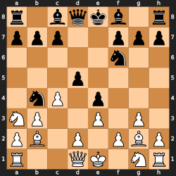

`r1bqkb1r/ppp2ppp/5n2/3p4/1nP1p3/NP2P1P1/PB1P1PBP/R2QK1NR b KQkq` — **Q: How many pieces are on the board in total?** — A: 32

---

## 3. Piece Location

#### `king_square` — Which square is the king on?
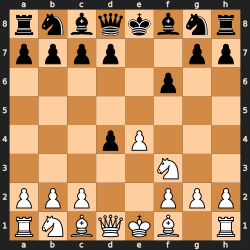

`rnbqkbnr/pppp2pp/5p2/8/3pP3/5N2/PPP2PPP/RNBQKB1R w KQkq` — **Q: Which square is the white king on?** — A: e1

#### `list_piece_squares` — List all squares for a piece type
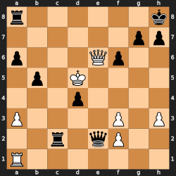

`r6k/6pp/p3Qp2/1p1K4/3p4/P4P1P/2r1qP2/R7 b` — **Q: List all squares occupied by white pawns.** — A: a3, f2, f3, h3

#### `is_piece_on_square` — Is there a specific piece on a specific square?
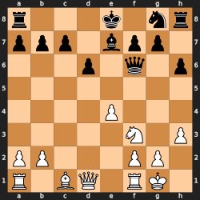

`r3k1nr/ppp1bpp1/3p1q1p/8/4P3/5N1P/PP3PP1/R1BQ1RK1 w kq` — **Q: Is there a white bishop on h2?** — A: No

---

## 4. Material

#### `which_side_more_material` — Which side has more material?
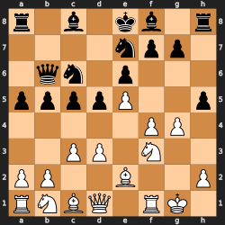

`r1b1kb1r/4npp1/1qn1p3/ppppP2p/5PP1/2PP1N2/PP2B2P/RNBQ1RK1 w kq` — **Q: Which side has more material? (P=1, N=3, B=3, R=5, Q=9)** — A: Equal

#### `material_value` — Total material value for one side?
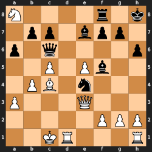

`N4r1k/1pp1bpp1/p1q4p/2P1Pb2/1PB1n3/P3Q3/5PPP/2KR3R b` — **Q: What is White's total material value? (P=1, N=3, B=3, R=5, Q=9)** — A: 32

#### `is_material_equal` — Is material equal?
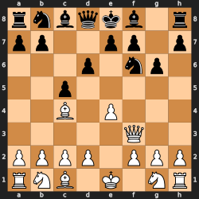

`rnbqkb1r/pp2pp1p/3p1np1/2p5/2B1P3/5Q2/PPPP1PPP/RNB1K1NR w KQkq` — **Q: Is the material equal? (P=1, N=3, B=3, R=5, Q=9)** — A: Yes

---

## 5. Rank & File

#### `count_on_rank` — How many pieces of a color on a rank?
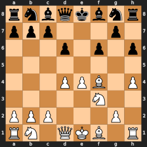

`rnbqkbnr/ppp3p1/3p1p1p/8/3PPB1P/5N2/PPP3P1/RN1QKB1R b KQkq` — **Q: How many black pieces are on rank 2?** — A: 0

#### `count_on_file` — How many pieces on a file?
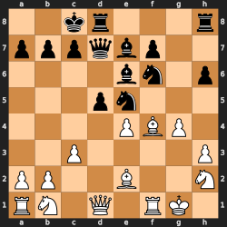

`2kr3r/pppqbp2/4bn1p/3pn3/4PBP1/2P4P/PP2B2N/RN1Q1RK1 b` — **Q: How many pieces are on the b-file?** — A: 3

#### `is_file_open` — Is a file open (no pawns)?
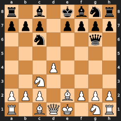

`r1b1kbnr/ppp1pppp/2n3q1/8/3P4/2N5/PPP1BPPP/R1BQK1NR w KQkq` — **Q: Is the e-file open (no pawns at all)?** — A: No

#### `is_file_half_open` — Is a file half-open for one side?
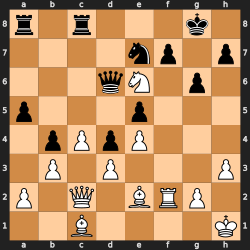

`r1r3k1/4np1p/3qN1p1/p3p3/1pPpP3/1P1P3P/P1Q1BRP1/2B4K b` — **Q: Is the f-file half-open for White?** — A: Yes

---

## 6. Pawn Structure

#### `doubled_pawns` — Does a side have doubled pawns?
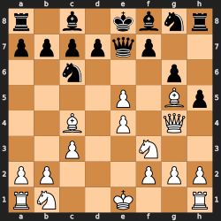

`r1b1kbnr/ppppqp2/2n3p1/4P1Bp/2B1P1Q1/2P2N2/PP3PPP/RN2K2R w KQkq` — **Q: Does White have doubled pawns? If so, on which file(s)?** — A: Yes, on the e-file

#### `isolated_pawn` — Does a side have isolated pawns?
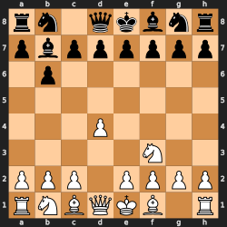

`rn1qkbnr/pbpppppp/1p6/8/3P4/5N2/PPP1PPPP/RNBQKB1R w KQkq` — **Q: Does White have any isolated pawns?** — A: No

#### `pawn_islands` — How many pawn islands?
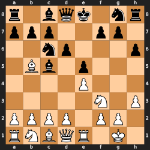

`r1bqk1nr/ppp2pp1/2np3p/1Bb1p3/4P3/5N1P/PPPP1PP1/RNBQR1K1 b kq` — **Q: How many pawn islands does White have?** — A: 1

#### `passed_pawn` — Does a side have a passed pawn?
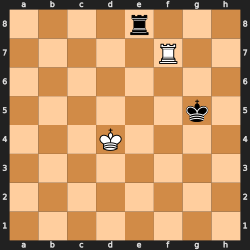

`4r3/5R2/8/6k1/3K4/8/8/8 b` — **Q: Does Black have a passed pawn?** — A: No

---

## 7. Metadata

#### `side_to_move` — Whose turn is it?
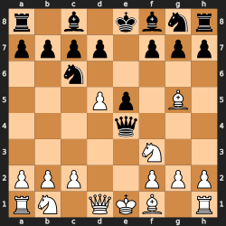

`r1b1kbnr/pppp1ppp/2n5/3Pp1B1/4q3/5N2/PPP2PPP/RN1QKB1R w KQkq` — **Q: Whose turn is it to move?** — A: White

#### `can_castle_kingside` — Can a side castle kingside?
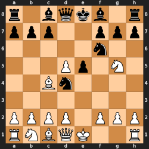

`r1bqkb1r/ppp2ppp/5n2/3Pp1N1/2Bn4/8/PPPP1PPP/RNBQK2R w KQkq` — **Q: Can White castle kingside?** — A: Yes

#### `can_castle_queenside` — Can a side castle queenside?
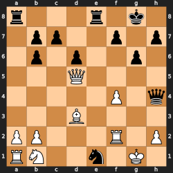

`r3r1k1/1pp2p1p/1p1p2p1/3Q4/5P1q/3B4/PP3R1P/RN2n1K1 w` — **Q: Can White castle queenside?** — A: No

#### `en_passant_square` — Is an en passant square available?
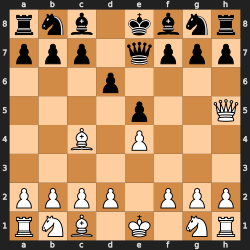

`rnb1kbnr/ppp1qppp/3p4/4p2Q/2B1P3/8/PPPP1PPP/RNB1K1NR w KQkq` — **Q: Is there an en passant square available? If so, which?** — A: No

#### `fullmove_number` — What is the fullmove number?
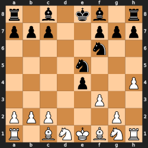

`r1b1kb1r/ppp2ppp/5n2/4n3/4p2P/5P2/PPP3P1/R1BNKBNR w KQkq` — **Q: What is the fullmove number?** — A: 8

#### `halfmove_clock` — What is the halfmove clock?
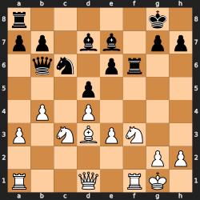

`r5k1/pp1bb1pp/1qn1pr2/3p4/1P1P4/P1NBPN2/6PP/R2Q1RK1 w` — **Q: What is the halfmove clock?** — A: 0

---

## 8. Spatial Relationships

#### `pieces_between` — Are there pieces between two squares on the same rank/file/diagonal?
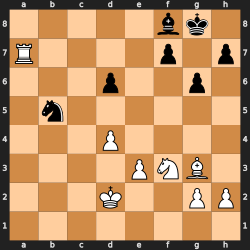

`5bk1/R4p1p/3p2p1/1n6/3P4/4PNB1/3K2PP/8 w` — **Q: Are there any pieces between f7 and h7?** — A: No

#### `same_rank` — Are the king and rook on the same rank?
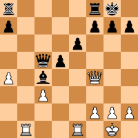

`r4rk1/p4ppp/4p3/2qp4/P1b2Q2/2P5/5PPP/1R2R1K1 w` — **Q: Are the black king and the black rook on a8 on the same rank?** — A: Yes

#### `same_file` — Are the king and rook on the same file?
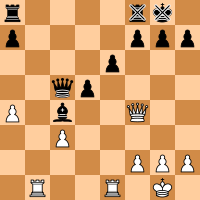

`r4rk1/p4ppp/4p3/2qp4/P1b2Q2/2P5/5PPP/1R2R1K1 w` — **Q: Are the black king and the black rook on f8 on the same file?** — A: No

---

## 9. Checks & Attacks

#### `is_in_check` — Is a king in check?
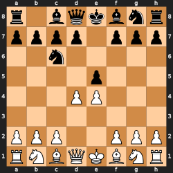

`r1bqkbnr/pppp1ppp/2n5/4p3/3PP3/8/PPP2PPP/RNBQKBNR w KQkq` — **Q: Is the black king in check?** — A: No

#### `attackers_of_square` — How many pieces of a color attack a square?
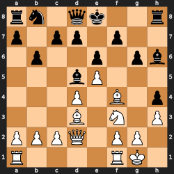

`rn1qk2r/p1pp1p2/1p2p1pb/3bP3/3P1B1p/3B1N1P/PPPQ1PP1/R4RK1 b kq` — **Q: How many white pieces attack e8?** — A: 0

#### `is_square_attacked` — Is a square attacked by a color?
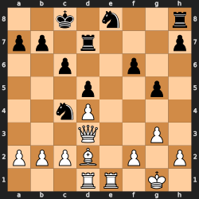

`2k1n2r/pp1r3p/2p2p2/3p2p1/2nP4/3Q2P1/PPPB1P1P/3RR1K1 w` — **Q: Is b2 attacked by white?** — A: No

---

## 10. Board Geometry

#### `square_color` — Is a square light or dark?
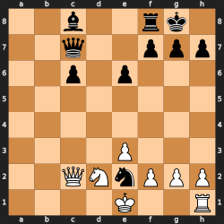

`2b2rk1/2q2ppp/2p1p3/8/8/4P3/2QNnPPP/4K2R w K` — **Q: Is c6 a light or dark square?** — A: Light

#### `bishop_pair` — Does a side have the bishop pair?
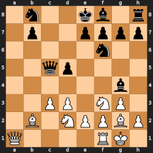

`1n2kb1r/1p2pppp/5n2/2qp4/6b1/2PP1NP1/1B1NPPBP/Q4RK1 w k` — **Q: Does White have the bishop pair (two or more bishops)?** — A: Yes

#### `bishop_square_colors` — What color squares are the bishops on?
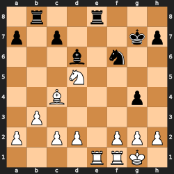

`1r2r3/p1p3kp/3b1n2/3N4/2B3p1/1P6/P1PP1PPP/4RRK1 b` — **Q: What color square(s) are black's bishop(s) on?** — A: Dark

---

## 11. After Move

#### `en_passant_after_move` — Is an en passant square available after playing a move?
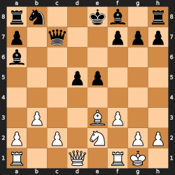

`rn2kb1r/p1q2ppp/b7/3pp3/8/1P2BP2/P1P1N1PP/R2Q1RK1 w kq` — **Q: After playing f4, is an en passant square available? If so, which?** — A: No
