# Eval: Legal Move Binary Classification

Binary classification eval: given a FEN and a single move, is it **legal** or **illegal**?

Each row: `(fen, move_uci, move_san, label, category, subcategory, phase)`

## Extraction

```bash
python extract_balanced_eval.py \
    --pgn_paths data/lichess_2013-01.pgn \
    --out_dir eval_legal_binary/dataset \
    --target 2000 --seed 42
```

## Subcategories (36 total)

### Legal (9)

#### `legal_move` — Normal piece move
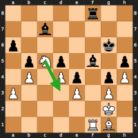

`5r2/2b5/p5k1/1pNp1b1p/1P1Pp1pP/P3P1P1/6K1/5RB1 w` — **Nd3** (c5d3)

#### `legal_capture` — Captures an enemy piece
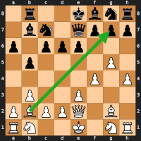

`1r2kbnr/1bn1qppp/p1ppp3/1p4P1/5P1P/1P2P3/PBPPQ1B1/RN2K1NR w KQk` — **Bxg7** (b2g7)

#### `legal_castling` — Legal castling
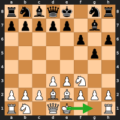

`rnbqk1nr/ppppp1b1/5p1p/6p1/8/3PPN2/PPPBBPPP/RN1QK2R w KQkq` — **O-O** (e1g1)

#### `legal_en_passant` — Legal en passant
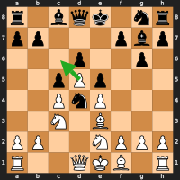

`r1bqk1nr/pp3pbp/3p2p1/2pPp3/2PnP3/2N1B3/PP2NPPP/R2QKB1R w KQkq c6` — **dxc6** (d5c6)

#### `legal_promotion` — Pawn promotes
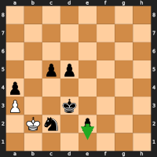

`8/8/8/2pp4/p7/P2k4/1Kn1p3/8 b` — **e1=N** (e2e1n)

#### `legal_check` — Move delivers check
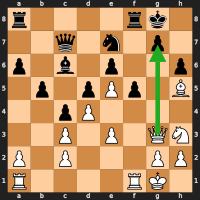

`r4rk1/2q1n1p1/p1b1p2p/1p1pPp1B/2pP4/2P1P1QN/P1P3PP/R4RK1 w` — **Qxg7+** (g3g7)

#### `legal_king_escape` — King moves out of check
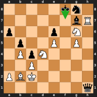

`5kn1/6bR/p3p1N1/1p2P1P1/1PpN4/2P5/PBK5/7q b` — **Kf7** (f8f7)

#### `legal_capture_checker` — Non-king captures the checking piece
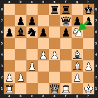

`4rr1k/1pp2qpp/pbnp1pN1/8/3PP1B1/2P3BP/PP4P1/R3QR1K b` — **hxg6** (h7g6)

#### `legal_block_check` — Non-king interposes on the check ray
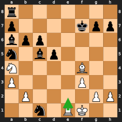

`r7/p4kpp/bpp5/n1bp4/N4B2/P4P2/1P4PP/2n1RK2 w` — **Re2** (e1e2)

---

### Illegal — Check Evasion (2)

#### `non_evasion_in_check` — Non-king move that doesn't address check
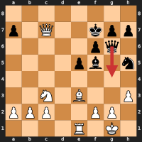

`8/p1Q2kpp/5pq1/4pb1n/8/2N1B2P/PPP2PP1/4R1K1 b` — **Qg4** (g6g4)

#### `non_king_double_check` — Non-king move in double check (only king moves are legal)
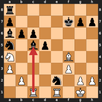

`r7/p4kpp/bpp5/n1bp4/N4B2/P4P2/1P2n1PP/2R1R1K1 w` — **Rxc5** (c1c5)

---

### Illegal — King (6)

#### `king_to_attacked` — King moves to a square controlled by opponent
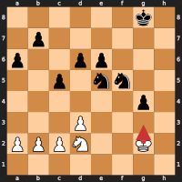

`6k1/1p6/p2pp3/2p1nn2/6p1/3P4/PPPN2K1/8 w` — **Kg3** (g2g3)

#### `castling_in_check` — Castling while king is in check
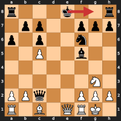

`r3k2r/1pp2ppp/p1p2n2/2P2b2/8/6N1/PPq2PPP/R1B1QRK1 b kq` — **O-O** (e8g8)

#### `castling_through_attacked` — Castling through/to a square controlled by opponent
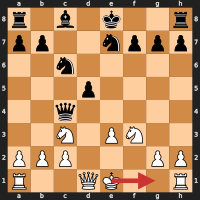

`r1b1k2r/pp2nppp/2n5/3p4/2q5/2N1PN2/PPP3PP/R2QK2R w KQkq` — **O-O** (e1g1)

#### `castling_path_occupied` — Castling with pieces between king and rook
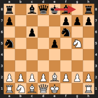

`r1bqkb1r/p4ppp/2p2n2/n3p1N1/8/8/PPPPBPPP/RNBQK2R b KQkq` — **O-O** (e8g8)

#### `castling_no_rights` — Castling when king or rook has already moved (rights lost)
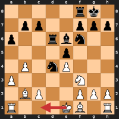

`5rk1/1pp2ppp/p2rbn2/4p3/1P1nP3/P4N2/1BP2PPP/R3KB1R w` — **O-O-O** (e1c1)

#### `wrong_geometry_king` — King moves more than one square (non-castling)
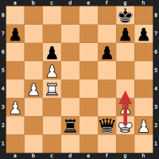

`6k1/p5pp/2p2p2/2P5/1PR5/P5P1/3r1qKP/8 w` — **Kg4** (g2g4)

---

### Illegal — Pin (1)

#### `pin_breaking` — Pinned piece moves off the pin ray, exposing king
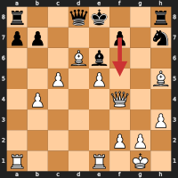

`r2qk2r/pp3p1n/3Bb3/2P1P2B/1P3Q2/7P/5PP1/R3R1K1 b kq` — **f5** (f7f5)

---

### Illegal — Pawn (6)

#### `backward_pawn` — Pawn moves backward
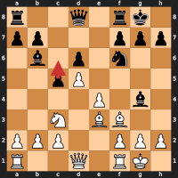

`r2q1rk1/pp3ppp/1b1p1n2/2pP4/4P1b1/2N1BB2/PPP2PPP/R2Q1RK1 b` — **c6** (c5c6)

#### `pawn_double_wrong_rank` — Double push from non-starting rank
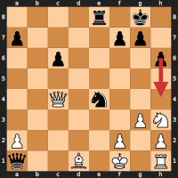

`4r1k1/p4pp1/2p4p/8/2Q1n3/6PN/P4P1P/q2B1K1R b` — **h4** (h6h4)

#### `pawn_double_push_blocked` — Double push from starting rank, intermediate square occupied
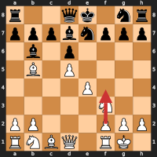

`r2qk1nr/pppbnppp/1b1p4/1B1P4/4P3/5N2/PP3PPP/RNBQ1RK1 w kq` — **f4** (f2f4)

#### `pawn_push_onto_piece` — Pawn pushes forward into occupied square
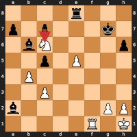

`4r3/p1p3k1/1bN4p/2p1P3/1P6/2P5/b5PP/5R1K b` — **cxc6** (c7c6)

#### `pawn_diagonal_to_empty` — Pawn moves diagonally to empty square (no capture)
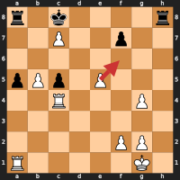

`r1k4r/2P2p2/8/pPp1P3/2R3P1/8/5PP1/R5K1 w` — **f6** (e5f6)

#### `pawn_capture_friendly` — Pawn captures own piece diagonally
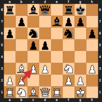

`r1bq1rk1/1p2bpp1/p1n2n1p/2pp4/8/1BPP1N1P/PP3PP1/RNBQR1K1 w` — **c3** (b2c3)

---

### Illegal — En Passant (4)

#### `ep_fake_diagonal` — Pawn diagonal to empty in EP position, but no adjacent enemy pawn
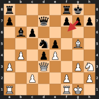

`r4rk1/p2q1ppp/1bp5/3np1B1/1P1pP3/P2Q2PN/2P2P1P/R4RK1 b - e3` — **f6** (g7f6)

#### `ep_wrong_pawn` — EP position exists, but this targets a pawn that didn't just double-push
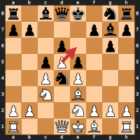

`r1bqk1nr/pp3pbp/3p2p1/2pPp3/2PnP3/2N1B3/PP2NPPP/R2QKB1R w KQkq c6` — **e6** (d5e6)

#### `wrong_ep` — Pawn on EP rank next to enemy pawn, but EP is not available
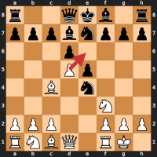

`r2qkb1r/pppbnppp/3p4/3Pp3/2B1n3/5N2/PPP2PPP/RNBQ1RK1 w kq` — **e6** (d5e6)

#### `ep_pinned` — Correct EP square, but capture reveals lateral attack on king
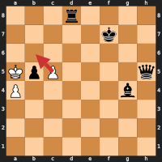

`3r4/5k2/8/KpP4q/P5b1/8/8/8 w - b6` — **cxb6** (c5b6)

---

### Illegal — Promotion (2)

#### `promo_push_blocked` — Promotion push onto occupied square
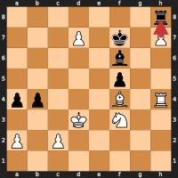

`7r/3P1k1P/5b2/5p2/pp3B1R/3K1N2/P1P5/8 w` — **hxh8=Q** (h7h8q)

#### `promo_capture_empty` — Promotion diagonal capture to empty square
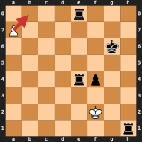

`4r3/P7/6k1/8/4rp2/8/5K2/7r w` — **b8=B** (a7b8b)

---

### Illegal — Piece Movement (6)

#### `friendly_fire` — Piece captures own piece
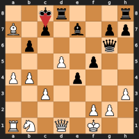

`2kr3r/B1p1b1pp/1p4q1/3P1p2/PP2p3/2P4P/5PP1/RN1Q1K2 b` — **Kc7** (c8c7)

#### `blocked_sliding` — Sliding piece moves through a blocker
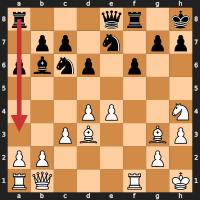

`r3qr1k/1pp1n1pp/pbnp1p2/8/3PP2N/2PB2BP/PP4P1/RQ3R1K b` — **Ra3** (a8a3)

#### `wrong_geometry_knight` — Knight moves diagonally (like a bishop)
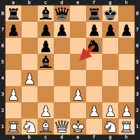

`r1bq1rk1/p1pp1ppp/2p2n2/2b5/1P6/P3P3/2P2PPP/RNBQK1NR b KQ` — **Ne5** (f6e5)

#### `wrong_geometry_bishop` — Bishop moves in straight line (like a rook)
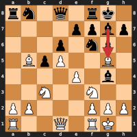

`rn1q1rk1/4ppbp/3p1np1/1BpP2B1/4P1b1/2N2N2/PP3PPP/R2Q1RK1 b` — **Bxg5** (g7g5)

#### `wrong_geometry_rook` — Rook moves diagonally (like a bishop)
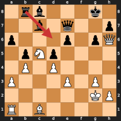

`1rb3k1/2b1q2p/p3p1pQ/1pNp4/1P1P4/P3P1P1/6KP/R1B5 b` — **Rd6** (b8d6)

#### `wrong_geometry_queen` — Queen moves in L-shape (like a knight)
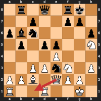

`1r1q1rk1/2p2pp1/pbn4p/1p1pp2N/4P3/2PPnN1P/PPB1QPP1/R2R2K1 w` — **Qc1** (e2c1)
